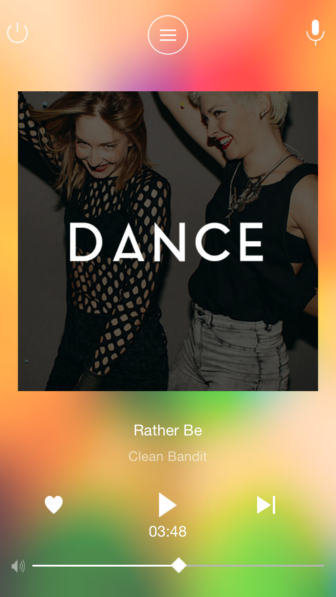

# Muse
Developed using XCode 6.4 in 4/5 hours. Target OS : 8.4. Langage : Swift 1.2

               

Music/Audio Player using API calls to retrieve audio files. Audio is streamed from a distant server
